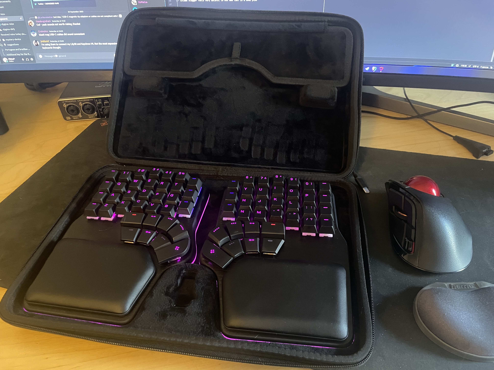
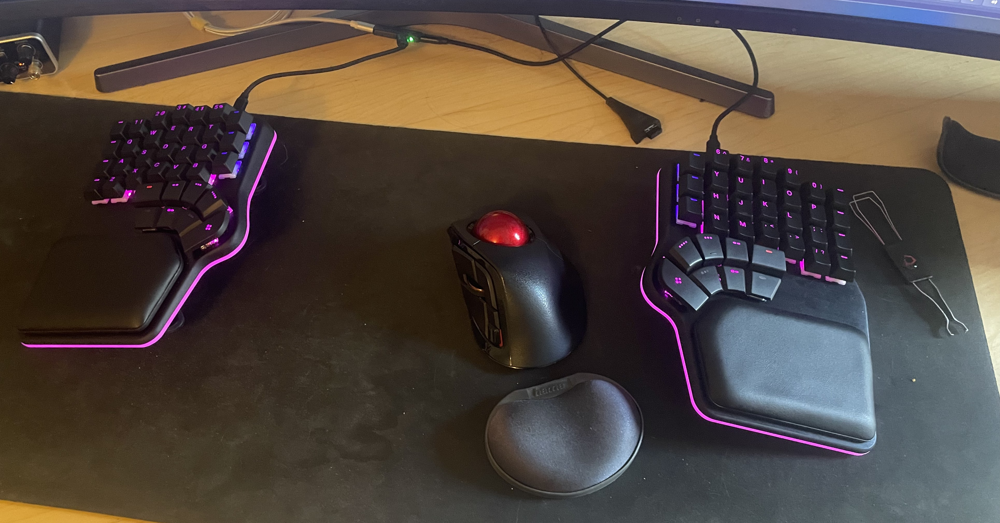
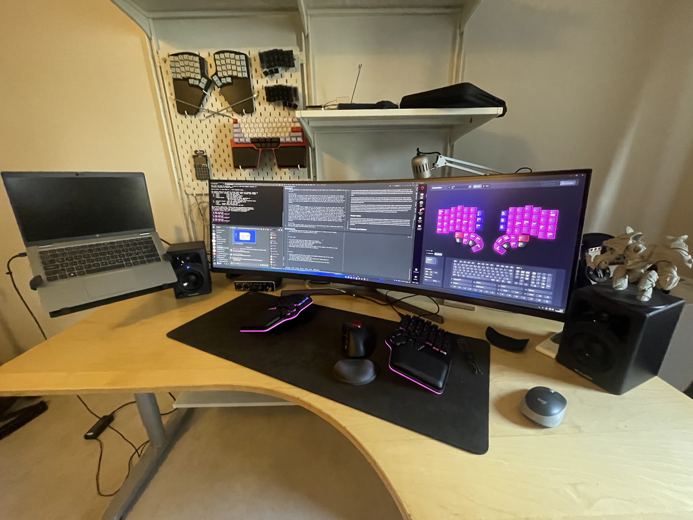

# Intro
I am not a professional reviewer, but I got an early shipped Dygma Defy for testing in the latter half of September.
It is a "full specced" version, so wireless, tenting, and underglow included. These are my first impressions.  
You can find my layer repository here: [https://github.com/tarbari/defy_layers](https://github.com/tarbari/defy_layers)  
I have not yet written a proper README.md, but the `img/` directory contains images for reference. Additionally, the 
`layers.json` file contains my backup.  

## Packaging
The packaging is very nice quality. Even the cardboard box is stamped with Dygma logos and the bubble wrap envelopes 
look really nice. Carry case feels super high quality with its velvety interior and sturdy outer shell. The only bad 
thing to say here is the slot for the Neuron, which is a tad bit too small to hold the Neuron in place.  

## Keycaps and palm pads
Keycaps are Cherry profile ABS caps. To me, they feel better than the new Raise ABS caps. I would attribute this to the 
thickness of the caps, which is about 1.3mm for the Defy and 0.9mm for the Raise. Personally, I have no preference 
between OEM and Cherry. However, from the perspective of replacing some or all of the 1u caps, Cherry is more common in the 
keyboard enthusiast world. The stabs of the choc v1 keycaps are still brittle, so when taking them off be careful not to 
snap them.  

The palm pads feel great. They are just squishy enough without being too soft and the magnets holding the 
pads down make them snap in place in a satisfying manner. 

## Tenting
In my experience Dygma really nailed the tenting solution this time. Raise had a solid tenting solution, but Defy just 
takes it to another level. The extra angles in the low-end give a lot of flexibility. To me personally 10 degrees is a 
bit too low and 20 degrees is just a bit too high - 15 degrees feels perfect! Reverse tilting opens up a lot of 
possibilities for higher sitting positions and standing desks. The tenting legs are just stiff enough to keep themselves 
in position even when the keyboard is upside down, which is exactly as stiff as it should be.

## Lights
The RGBW LEDs are a significant upgrade over the Raise LEDs or any RGB LEDs I have seen for that matter. The white is 
much more white, and as for the brightness, Dygma did not oversell it in their videos. I have the brightness set to 5%, 
and it is plenty bright. I would like the brightness control to be more fine, currently it is in 5% increments.  

## Neuron
I wish I could turn off the LED when everything is working fine. I don't see any additional benefit for the green light 
to be pulsing all the time. There have been reports that the cables provided might have too short tips for them to 
reach the Neuron sockets properly. I don't have this problem, but I feel it is only a matter of fractions of millimeter 
for this to be a problem for me as well. Dygma has stated that they will redesign the Neuron case to accommodate this 
problem.  

I use my keyboard with an USB2 cable from computer to the Neuron and the more 
flexible USB cables of the Raise from Neuron to the Defy halves. The keyboard works as expected. Flashing does not work 
however, and this is widely known already. Flashing works only in wired mode and with proper USB3 cables. If something 
does not work as expected, I would recommend making sure you are using the cables that came with the Defy. 

## Wireless and wired modes
In wired mode my Defy has worked flawlessly. No lags or hiccups at all.  

In RF mode I have once experienced weird behaviour with the LEDs starting to pulse red as if the halves were not 
connected to the Neuron, but the keyboard continued working otherwise normally and power cycling the keyboard - unplug 
neuron, turn both halves off, plug neuron and power on the halves - fixed this. RF mode doesn't seem to have any 
significant lag over the wired mode.  

With the latest firmware bluetooth mode also works relatively well. There is a bit of increase in lag, which for me 
made it hard to use. Especially home row mods are pretty sensitive to lag. The lag might be due to my environment or 
related to my computers bluetooth adapters since I have read that others have felt no problems with lag. Unfortunately, 
I've been unable to test this, other than trying two computers. The problem persisted in both.  

Changing the paired bluetooth device is now really easy. Just add the BT pairing function to a key of your choice, and 
you can change to one of the five different profiles in the keyboard. If the profile has a device paired and the device 
is available, it takes a couple of seconds for the handshake to complete, and you are ready to go. If there is no 
device paired, you can find the Defy from the bluetooth menu of your device and pair it. The profiles are bound to 
number keys on both halves and under each profile key you have a button to remove the pairing marked by a red color.

## Battery life
In one word the battery life is adequate. I haven't done any extensive testing, but using the keyboard in RF or BT mode 
the battery lasts easily for a whole day. I have not optimised for battery life, so it could last for two days or maybe 
more with the LEDs turned completely off. For reference, I use 5% LED brightness with no LED timeout and highlight layer 
changes is on. RF energy saving is on low, which means the RF coverage is lowest thus saving most energy. The largest 
saving would be to either turn LEDs completely off or add a timeout for the LEDs to turn off after few minutes of no 
inputs.

## Key layout
I have used a similar column stagger before, so I have a bit of experience in this regard. I have never felt column 
stagger to be hard to learn, and after just a few hours of use it starts to feel way more natural than a row staggered 
layout. While some might prefer a more aggressive pinky stagger, I very much like the amount Dygma chose. More stagger 
would make the top row easier to access with pinky, but it would also make the bottom row less accessible.  

The inner columns are perfect for commonly used shortcuts. I have superkeys for copy, paste, and undo bound to the left 
side. Initially I had them mirrored to the right side as well, but I had a lot of miss clicks when typing. So for now I 
decided to leave the right side unused. In the beginning the inner columns threw my muscle memory a bit off and I had 
problems finding the correct home row position without looking at the keyboard. This went away after about two days of 
use. 

Over all the layout fits my use perfectly. I use home row mods, so I don't miss the modifier row below alphas. For
gaming, I use WASD and left shift is the bottom left corner key. Left control is next to A which feels still a bit
unintuitive, but I'm slowly getting used to it. I played around with the idea of either rebinding movement to ESDF or 
making my gaming layer have WASD in place of ESDF. In the end I felt like both of those solutions would be too much of 
a hassle to either rebind keys in games or learn a completely unique layer just for gaming.  

## Thumb cluster
This is the star of the show in my opinion. Eight thumb keys on each side gives tons of flexibility to the keyboard. 
Not all the keys are comfortable to use, nor are they meant to be. To me the most comfortable ones are T2, T3 and T4. 
T6 and T8 are ok. T1 is just borderline usable in special cases when my hands are properly on the home row. In the 
gaming layer my hand is on WASD so that makes T1 comfortable and T8 too far away. Under normal use T5 and T7 feel very 
awkward to use. What keys feel comfortable to you will depend on your hand size and how you place your hands on the 
keyboard. Below you can see the thumb key naming convention for reference.  

I use the thumb clusters mainly for layer switching, space bar, enter, backspace, and delete. Other uses could be 
modifiers or utility shortcuts like launching an app from the Windows taskbar. If the shortcut is only rarely used you 
could utilize the more uncomfortable keys for it to leave the others to more common functionalities.

## Firmware and Bazecor
I won't go into too much detail on Bazecor except for the Defy specific stuff. Now with the latest beta release a lot 
of the firmware problems have been ironed out. Overall the experience is a bit behind the Raise, but this is to be 
expected since the Defy firmware is still beta after all. When creating layers I have experienced some communication 
timeouts with Bazecor, and had to close Bazecor, replug the keyboard, and start over from last save. So my advice is to 
**save often**. LED brightness control seems to behave a bit weird. Sometimes it follows the slider from the preferences, 
and sometimes it follows the sliders from the wireless advanced settings even when connected wired. The good thing with 
the wireless advanced settings is that you can control the brightness in 1% increments but the UX is not intuitive and 
this seems to be a bug. The battery indicator sometimes loses track of what the actual state of the battery is, but it 
can be fixed by power cycling the keyboard. Besides these I have not experienced any significant problems with the 
firmware or software, so I would say it is in ok state. The great thing is that Dygma is constantly working on 
improving this aspect of their keyboards. 

## Conclusion
Defy is a great ergonomic keyboard. Best I have used so far. Even with the minor flaws in firmware and software side 
the UX has been better than other keyboards I have tried.

